##  Raye Pamber

**`Computer Scientist · Cyber Security Expert · Vulnerability Researcher`**

I've spent years operating deep inside code, systems, and networks — not just building them, but **dissecting them** to understand how they truly work under pressure.

My work sits at the intersection of offensive and defensive security. I approach every system with the mindset of an adversary, then use that knowledge to make it stronger.

**Areas of focus:**

- 🔴 Red Team Operations & Adversary Simulation
- 🎯 Advanced Persistent Threat (APT) Analysis
- 🔬 Vulnerability Research & Reverse Engineering
- 🕵️ OSINT Reconnaissance & Exploitation
- 🛡️ Firewall Evasion & IDS/IPS Bypass
- 🦠 Malware Analysis & Sandbox Evasion
- 💥 Exploit Development
- 🌐 Infrastructure & Network Hacking

> *"Every vulnerability I find is one less threat to someone's data, privacy, or livelihood."*

---

##  Connect

---

##  GitHub Activity

<!-- METRICS GENERATED VIA GITHUB ACTIONS -->
<!-- Last updated: Daily at 00:00 UTC -->

### 📊 STATISTICS

### 🔥 STREAK

### 💻 LANGUAGES

### 📈 Contribution Activity

### 🏆 Top Contributed Repositories

---

## 🏆 TROPHY CASE

<!-- TROPHIES GENERATED VIA GITHUB ACTIONS -->
<!-- Theme: Matrix - Black with green glow -->

---

##  TECH STACK

### Languages

  
  
  
  
  
  
  
  
  
  
  

### Cloud & Infrastructure

  
  
  
  
  
  
  
  
  
  
  
  

### Frameworks & Runtimes

  
  
  
  
  
  
  
  
  
  
  
  
  

### DevOps & CI/CD

  
  
  
  
  
  
  
  
  
  

### Databases

  
  
  
  
  
  
  

### Data Science & ML

  
  
  
  
  

### Security & Networking Tools

  
  
  
  
  
  
  

### Game Engines

  
  
  
  
  

---

## 💰 Support the Mission

If my work has helped secure your systems or taught you something new:

---

<!-- SYSTEM STATUS: ONLINE -->
<!-- LAST ENCRYPTION: ACTIVE -->
<!-- NO TRACE LEFT BEHIND -->
